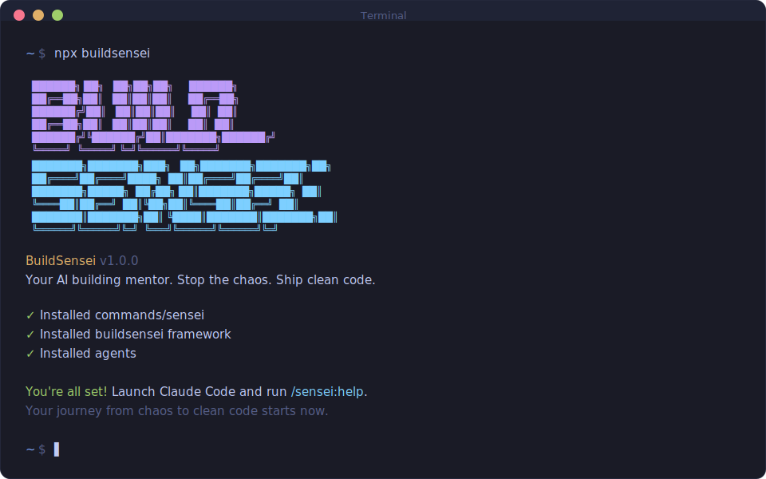

<div align="center">

# BuildSensei

**Your AI building mentor. Stop building chaos. Start shipping code that actually works.**

[](https://www.npmjs.com/package/buildsensei)
[](LICENSE)

<br>

```bash
npx buildsensei
```

**Works on Mac, Windows, and Linux.**

**New to BuildSensei?** Run `/sensei` for an interactive menu that guides you to the right command.

<br>



<br>

</div>

---

## The Problem Every Vibecoder Knows

You've been there. We've all been there.

You start with an idea. You vibe with Claude. Things are flowing. Then three hours later you're staring at:

- 47 files scattered across directories that make no sense
- An authentication system that "worked 10 minutes ago"
- Spaghetti code that even Claude can't untangle anymore
- That sinking feeling when Claude says *"Due to context limits, I'll be more concise now"*

**That's the shit show.** And it happens because vibe-coding without structure is like building a house by randomly nailing boards together and hoping it becomes a mansion.

BuildSensei is the mentor that keeps you on track. It's the framework that transforms chaotic AI-assisted development into structured builds that actually ship.

---

## What BuildSensei Actually Does

**It's not another complicated project management system.** You don't need Jira. You don't need sprint ceremonies. You don't need to pretend you're running a 50-person engineering org.

BuildSensei is a meta-prompting framework that:

1. **Extracts what you actually want** through smart questioning
2. **Creates a structured roadmap** so Claude knows where it's going
3. **Breaks work into focused chunks** so Claude never loses context
4. **Executes with fresh subagents** so quality never degrades
5. **Verifies the work** so you don't ship broken garbage

The magic? Each task runs in a fresh Claude context. 200k tokens purely for implementation. Zero accumulated garbage from earlier conversations. No more *"I'll be more concise"* — just consistent, high-quality code.

---

## The Workflow (It's Simpler Than You Think)

### 1. Capture Your Idea

```
/sensei:new-project
```

BuildSensei asks you questions. Good questions. It keeps asking until it truly understands what you want — your goals, constraints, edge cases, the whole picture. This becomes **PROJECT.md**, the north star for everything that follows.

### 2. Define What "Done" Looks Like

```
/sensei:define-requirements
```

What's v1? What's v2? What's absolutely not happening? Get crystal clear on scope so Claude isn't guessing or adding features you didn't ask for.

### 3. Create Your Roadmap

```
/sensei:create-roadmap
```

Phases. Milestones. A clear path from here to shipped product. Plus **STATE.md** — living memory that persists across sessions so you never have to re-explain context.

### 4. Plan and Execute

```
/sensei:plan-phase 1      # Creates atomic task plans
/sensei:execute-phase 1   # Parallel agents execute everything
```

Each plan has 2-3 tasks max. Each runs in a fresh subagent. Plans without dependencies run in parallel. Walk away, come back to completed work.

### 5. Ship It

```
/sensei:complete-milestone
```

Archive v1. Prep for v2. Repeat. You've now shipped something that actually works.

---

## Why This Actually Works

### Fresh Context, Every Time

Here's the dirty secret of vibe-coding: as Claude fills its context window, quality tanks. You've seen it happen. Code gets sloppier. Instructions get ignored. That's context rot.

BuildSensei fixes this by design:

| Traditional Vibe-Coding | BuildSensei |
|------------------------|-------------|
| Task 1: Fresh context, good code | Task 1: Fresh subagent, perfect code |
| Task 5: Cluttered context, okay code | Task 5: Fresh subagent, perfect code |
| Task 10: "I'll be more concise" | Task 10: Fresh subagent, perfect code |

Every task gets the full 200k token context. No degradation. No cut corners.

### Structured but Not Bureaucratic

BuildSensei gives you structure without the enterprise theater:

- **PROJECT.md** — Your vision, always loaded
- **REQUIREMENTS.md** — What you're building
- **ROADMAP.md** — How you're getting there
- **STATE.md** — What's happened, what's blocked, where you are
- **PLAN.md** — The exact task being executed

No sprint planning. No story points. No stakeholder syncs. Just the context Claude needs to do its job.

### Git Commits That Make Sense

Each task = one commit. Immediately after completion.

```bash
abc123f feat(08-02): add email confirmation flow
def456g feat(08-02): implement password hashing
hij789k feat(08-02): create registration endpoint
```

When something breaks, `git bisect` tells you exactly which task caused it. Each task is independently revertable. Your git history actually tells a story.

---

## Getting Started

### Install

```bash
npx buildsensei
```

That's it. Verify with `/sensei:help` inside Claude Code.

### Recommended: Skip Permissions Mode

BuildSensei is designed for frictionless automation:

```bash
claude --dangerously-skip-permissions
```

> [!TIP]
> Stopping to approve `date` and `git commit` 50 times defeats the purpose. Trust the workflow.

### Staying Updated

```
/sensei:whats-new        # See what's new
```

```bash
npx buildsensei@latest   # Update
```

---

## Already Have Code? (Brownfield Projects)

### 1. Map Your Codebase

```
/sensei:map-codebase
```

Parallel agents analyze your existing code and create documentation in `.planning/codebase/`:

- **STACK.md** — Languages, frameworks, dependencies
- **ARCHITECTURE.md** — Patterns, layers, data flow
- **STRUCTURE.md** — Directory layout
- **CONVENTIONS.md** — Code style, naming patterns
- **TESTING.md** — Test framework and patterns
- **CONCERNS.md** — Tech debt, known issues

### 2. Continue As Normal

```
/sensei:new-project → /sensei:define-requirements → /sensei:create-roadmap → /sensei:plan-phase → /sensei:execute-phase
```

The codebase docs load automatically during planning. Claude knows your patterns and conventions.

---

## Command Aliases

Quick shortcuts for power users:

| Alias | Full Command |
|-------|--------------|
| `/sensei:sp` | `/sensei:plan-phase` |
| `/sensei:ep` | `/sensei:execute-phase` |
| `/sensei:prog` | `/sensei:progress` |
| `/sensei:np` | `/sensei:new-project` |
| `/sensei:cr` | `/sensei:create-roadmap` |

---

## All Commands

### Setup

| Command | What It Does |
|---------|--------------|
| `/sensei:new-project` | Extract your idea through questions |
| `/sensei:research-project` | Research domain ecosystem |
| `/sensei:define-requirements` | Scope v1/v2/out-of-scope |
| `/sensei:create-roadmap` | Create phases mapped to requirements |
| `/sensei:map-codebase` | Analyze existing codebase |

### Execution

| Command | What It Does |
|---------|--------------|
| `/sensei:plan-phase [N]` | Generate task plans for phase |
| `/sensei:execute-phase <N>` | Execute all plans with parallel agents |
| `/sensei:execute-plan` | Run single plan interactively |
| `/sensei:progress` | Where am I? What's next? |

### Verification

| Command | What It Does |
|---------|--------------|
| `/sensei:verify-work [N]` | User acceptance test |
| `/sensei:plan-fix [plan]` | Plan fixes for issues |

### Milestones

| Command | What It Does |
|---------|--------------|
| `/sensei:complete-milestone` | Ship it, prep next version |
| `/sensei:discuss-milestone` | Gather context for next milestone |
| `/sensei:new-milestone [name]` | Create new milestone |

### Phase Management

| Command | What It Does |
|---------|--------------|
| `/sensei:add-phase` | Append phase to roadmap |
| `/sensei:insert-phase [N]` | Insert urgent work between phases |
| `/sensei:remove-phase [N]` | Remove phase, renumber subsequent |
| `/sensei:discuss-phase [N]` | Gather context before planning |
| `/sensei:research-phase [N]` | Deep research for unfamiliar domains |

### Session

| Command | What It Does |
|---------|--------------|
| `/sensei:pause-work` | Create handoff when stopping mid-phase |
| `/sensei:resume-work` | Restore from last session |

### Utilities

| Command | What It Does |
|---------|--------------|
| `/sensei:add-todo [desc]` | Capture idea for later |
| `/sensei:check-todos` | List pending todos |
| `/sensei:debug [desc]` | Systematic debugging |
| `/sensei:help` | Show all commands |

---

## Troubleshooting

**Commands not found?**
- Restart Claude Code to reload slash commands
- Check `~/.claude/commands/sensei/` exists

**Something not working?**
- Run `/sensei:help` to verify installation
- Re-run `npx buildsensei` to reinstall

**Using Docker?**
```bash
CLAUDE_CONFIG_DIR=/home/youruser/.claude npx buildsensei --global
```

---

## License

MIT License. See [LICENSE](LICENSE) for details.

---

<div align="center">

**Stop the chaos. Ship clean code.**

*Your journey from vibe-coding disasters to structured builds starts now.*

</div>
